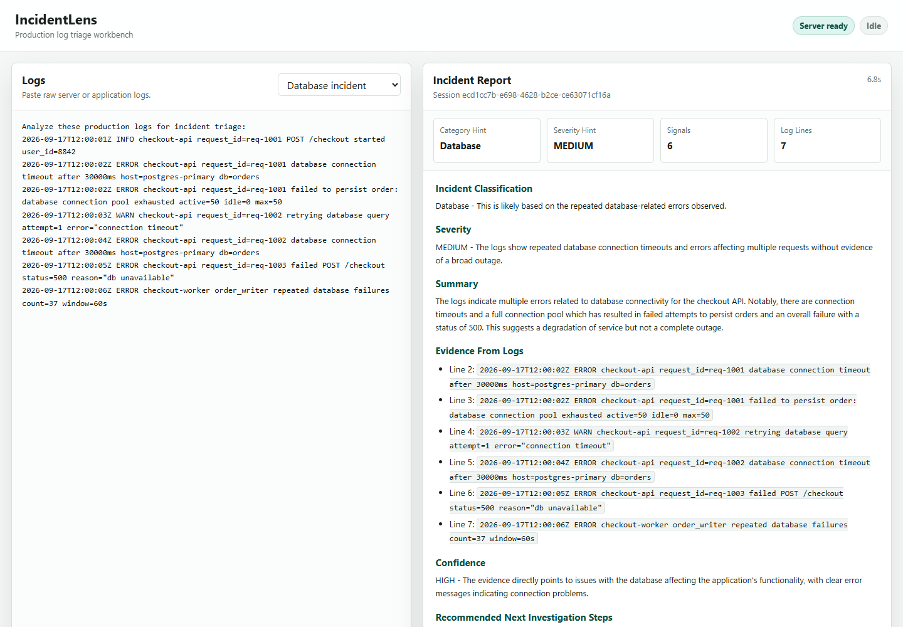

# IncidentLens

**AI incident triage for production logs.**

IncidentLens is an MVP incident-triage agent built with Google's Agent
Development Kit. Paste server or application logs and it returns a structured,
evidence-grounded incident report: classification, severity, summary, cited log
evidence, confidence, recommended next steps, and uncertainty.

[](https://www.python.org/)
[](https://google.github.io/adk-docs/)
[](https://fastapi.tiangolo.com/)
[](#current-status)
[](LICENSE)



## Why IncidentLens

Production incidents are noisy. Logs often contain a mix of useful signals,
routine warnings, retries, and incomplete clues. IncidentLens helps responders
turn that raw text into a concise first-pass incident report while keeping a
clear boundary between observed facts, likely conclusions, and missing evidence.

IncidentLens is designed to:

- identify the strongest error signals in supplied logs
- classify incidents as `Application`, `Infrastructure`, `Database`,
  `Authentication / Authorization`, or `Unknown / Insufficient Evidence`
- estimate severity as `LOW`, `MEDIUM`, `HIGH`, or `CRITICAL`
- cite the exact log evidence used for the report
- avoid inventing facts that are not present in the logs
- call out uncertainty when the logs are incomplete or ambiguous

## Current Status

This is an MVP for local review and evaluation. It is useful for demonstrating
an evidence-first incident-triage workflow, but it is not production-ready and
does not replace human judgment, metrics, traces, or service-owner
investigation.

## What It Returns

IncidentLens produces:

- incident classification
- severity
- grounded summary
- evidence from the supplied logs
- confidence
- recommended next investigation steps
- uncertainty and missing evidence

Allowed classifications:

- `Application`
- `Infrastructure`
- `Database`
- `Authentication / Authorization`
- `Unknown / Insufficient Evidence`

Allowed severities:

- `LOW`
- `MEDIUM`
- `HIGH`
- `CRITICAL`

## Project Structure

```text
incidentlens/
|-- app/
|   |-- agent.py         # IncidentLens ADK agent and prompt
|   |-- tools.py         # Lightweight deterministic log signal extraction
|   |-- fast_api_app.py  # Scaffolded FastAPI backend server
|   `-- app_utils/       # Scaffold utilities and A2A helpers
|-- docs/
|   |-- assets/
|   |-- HUMAN_REVIEW.md
|   |-- LOCAL_TEST_NOTES.md
|   |-- EVAL_REPORT.md
|   |-- EVAL_FIX_LOG.md
|   `-- DEPLOYMENT_REPORT.md
|-- frontend/            # Custom IncidentLens review UI
|-- tests/eval/          # Eval dataset, metrics, and runner
|-- AGENTS.md            # Coding-agent project guidance
`-- pyproject.toml       # Project dependencies
```

## Quick Start

From PowerShell:

```powershell
git clone https://github.com/Ani-107/IncidentLens.git
cd IncidentLens

$env:OPENAI_API_KEY = '<set your key in this terminal>'

uv run uvicorn app.fast_api_app:app --host 127.0.0.1 --port 8000
```

Open:

```text
http://127.0.0.1:8000/incidentlens
```

Paste one of the demo scenarios below into the interface. The expected response
is a structured incident report with classification, severity, evidence,
confidence, recommendations, and uncertainty.

The ADK developer UI is still available at:

```text
http://127.0.0.1:8000/dev-ui/?app=app
```

## Demo Scenarios

### Database Incident

```text
Analyze these production logs for incident triage:
2026-09-17T12:00:01Z INFO checkout-api request_id=req-1001 POST /checkout started user_id=8842
2026-09-17T12:00:02Z ERROR checkout-api request_id=req-1001 database connection timeout after 30000ms host=postgres-primary db=orders
2026-09-17T12:00:02Z ERROR checkout-api request_id=req-1001 failed to persist order: database connection pool exhausted active=50 idle=0 max=50
2026-09-17T12:00:03Z WARN checkout-api request_id=req-1002 retrying database query attempt=1 error="connection timeout"
2026-09-17T12:00:04Z ERROR checkout-api request_id=req-1002 database connection timeout after 30000ms host=postgres-primary db=orders
2026-09-17T12:00:05Z ERROR checkout-api request_id=req-1003 failed POST /checkout status=500 reason="db unavailable"
2026-09-17T12:00:06Z ERROR checkout-worker order_writer repeated database failures count=37 window=60s
```

### Application Incident

```text
Analyze these production logs for incident triage:
2026-09-17T12:10:00Z INFO orders-api request_id=req-2001 GET /orders/553 started
2026-09-17T12:10:01Z ERROR orders-api request_id=req-2001 HTTP 500 Internal Server Error
2026-09-17T12:10:01Z ERROR orders-api request_id=req-2001 Unhandled TypeError: Cannot read properties of undefined (reading 'total')
2026-09-17T12:10:01Z ERROR orders-api request_id=req-2001 stacktrace: TypeError at calculateInvoiceTotal (/srv/app/invoice.js:88:14)
2026-09-17T12:10:01Z ERROR orders-api request_id=req-2001 stacktrace: at handleGetOrder (/srv/app/routes/orders.js:142:9)
2026-09-17T12:10:02Z INFO orders-api request_id=req-2001 response status=500 duration_ms=842
```

### Infrastructure Incident

```text
Analyze these production logs for incident triage:
2026-09-17T12:20:03Z WARN payments-api pod=payments-api-7c9 memory usage 94 percent limit=1024Mi
2026-09-17T12:20:05Z ERROR kernel pod=payments-api-7c9 container=app OOMKilled memory cgroup out of memory
2026-09-17T12:20:06Z ERROR kubelet pod=payments-api-7c9 container app exited code=137 reason=OOMKilled
2026-09-17T12:20:08Z ERROR payments-api health check failed after container restart status=503
2026-09-17T12:20:11Z WARN load-balancer upstream payments-api no healthy endpoints available
```

### Authentication / Authorization Incident

```text
Analyze these production logs for incident triage:
2026-09-17T12:30:00Z INFO gateway request_id=req-4001 GET /api/profile started
2026-09-17T12:30:01Z WARN gateway request_id=req-4001 HTTP 401 Unauthorized path=/api/profile
2026-09-17T12:30:01Z ERROR auth-service request_id=req-4001 token validation failed reason="signature verification failed" kid=prod-key-17
2026-09-17T12:30:01Z WARN auth-service request_id=req-4002 OAuth token expired audience=incidentlens-api
2026-09-17T12:30:02Z WARN gateway request_id=req-4003 HTTP 403 Forbidden path=/admin/users role=viewer
```

### Insufficient Evidence

```text
Analyze these production logs for incident triage:
2026-09-17T12:40:00Z INFO worker job_id=job-991 started
2026-09-17T12:40:02Z ERROR worker job_id=job-991 operation failed
2026-09-17T12:40:03Z INFO worker job_id=job-991 exiting with status=1
```

## Run A Single Prompt

You can also run from the command line:

```powershell
cd <path-to-incidentlens>
$env:OPENAI_API_KEY = '<set your key in this terminal>'
agents-cli run "Analyze these logs: 2026-09-17T12:40:02Z ERROR worker job_id=job-991 operation failed"
```

## Run The Evaluation Suite

Start the local playground first with `OPENAI_API_KEY` available in the same
terminal as the server process. Then, in a second terminal:

```powershell
cd <path-to-incidentlens>

uv run python tests\eval\run_incidentlens_eval.py --url http://127.0.0.1:8000 --app-name app
```

Evaluation artifacts and notes:

- `tests/eval/datasets/incidentlens-baseline.json`
- `tests/eval/results/incidentlens_baseline_20260917_121927.json`
- `docs/EVAL_REPORT.md`
- `docs/EVAL_FIX_LOG.md`

The latest documented post-fix eval attempt failed because the running ADK
process did not have `OPENAI_API_KEY` in its environment. A successful post-fix
comparison is still needed before judging the effect of the fixes.

## Human Review

Start with:

- `docs/HUMAN_REVIEW.md`
- `docs/LOCAL_TEST_NOTES.md`
- `docs/EVAL_REPORT.md`
- `docs/EVAL_FIX_LOG.md`

The review package distinguishes what was observed in manual testing, what was
measured by baseline eval, what changed after the eval-fix loop, and what
remains uncertain.

## Development Notes

Edit the agent instruction in `app/agent.py`.

Edit deterministic log extraction hints in `app/tools.py`.

This MVP intentionally avoids deployment, observability setup, Slack/email
integration, automatic remediation, and complex multi-agent architecture.

## License

Apache License 2.0. See `LICENSE`.

If IncidentLens helps you think more clearly during production incidents, a star
helps other engineers find it.
